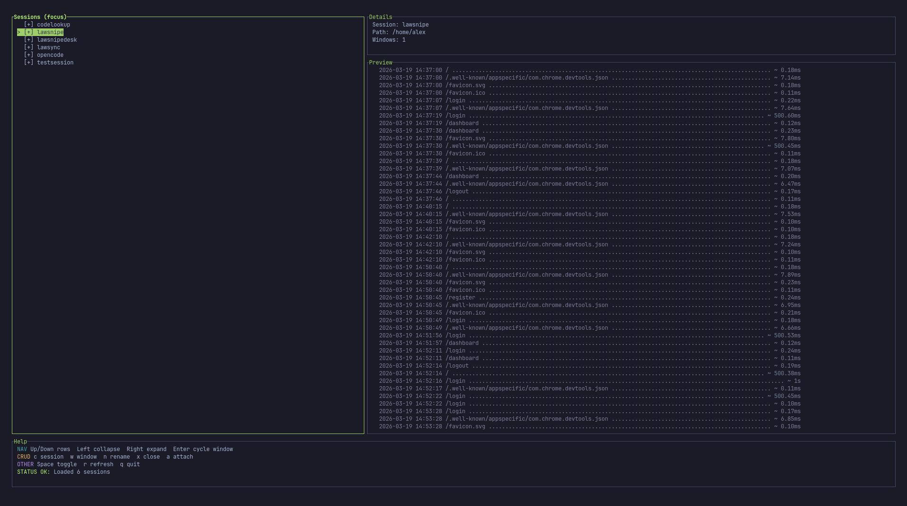

# tuimux

`tuimux` is a full-screen Rust TUI for browsing and managing tmux sessions.

It gives you a fast dashboard to:
- view sessions and nested windows in a tree
- inspect session metadata and live pane output preview
- create, attach, rename, and close sessions/windows from keybindings



## Features

- 3-panel layout:
  - **Left:** session/window tree (collapsed by default)
  - **Right:** details + live preview
  - **Bottom:** color-coded keybinding help + status
- Green-themed Ratatui interface
- Resilient refresh behavior (handles empty/no-server cases)
- Async preview capture worker so scrolling/navigation stays responsive

## Requirements

- Rust toolchain (stable)
- `tmux` installed and available in `PATH`
- Linux/macOS shell environment

## Install

From crates.io
```bash
cargo install tuimux
```

From this repository:
```bash
cargo install --git https://github.com/AlextheYounga/tuimux.git tuimux
```

## Keybindings

Navigation:
- `Up` / `k`: move selection up through visible rows
- `Down` / `j`: move selection down through visible rows
- `Left` / `h`: collapse selected session
- `Right` / `l`: expand selected session
- `Enter`: cycle selected window for the selected session
- `Space`: toggle expand/collapse
- `r`: refresh sessions

Actions:
- `a`: attach to selected session/window
- `c`: create session
- `w`: create window
- `n`: rename selected session/window
- `x`: close selected session/window (with confirmation)

Quit:
- `q`, `Esc`, or `Ctrl-C`

